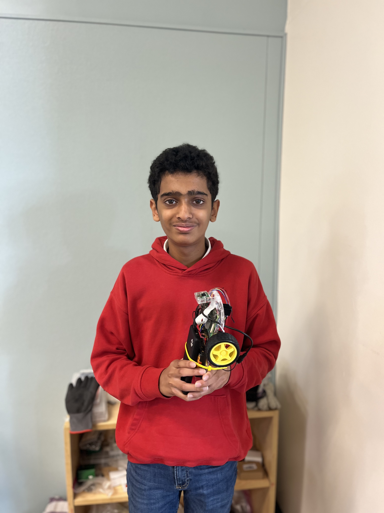
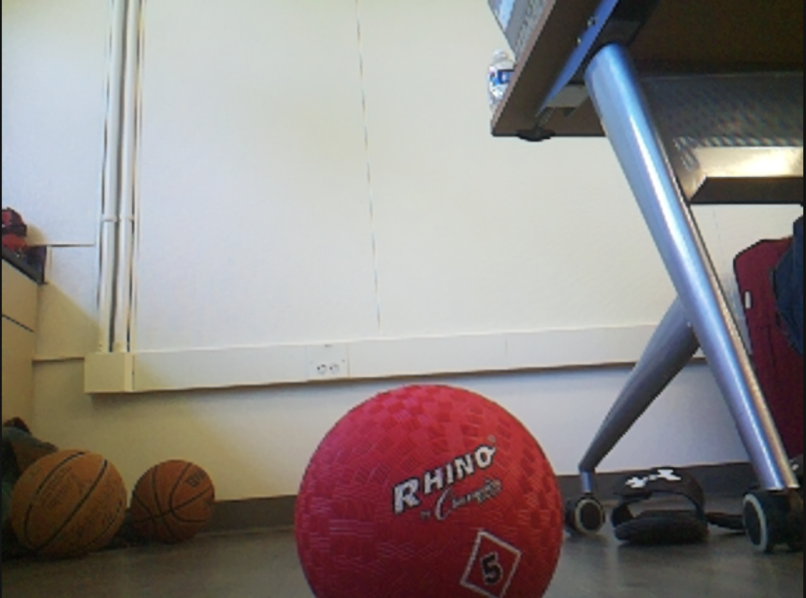
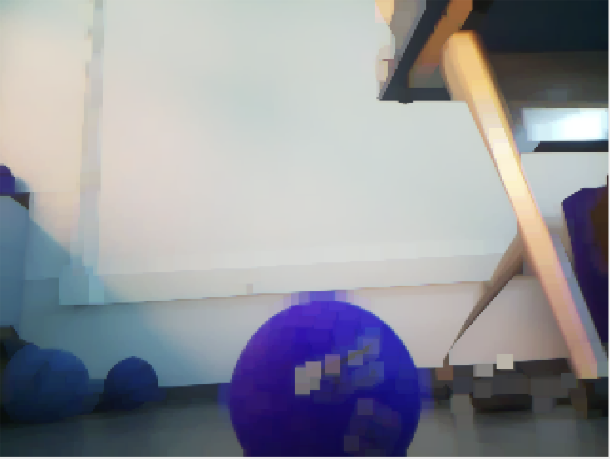
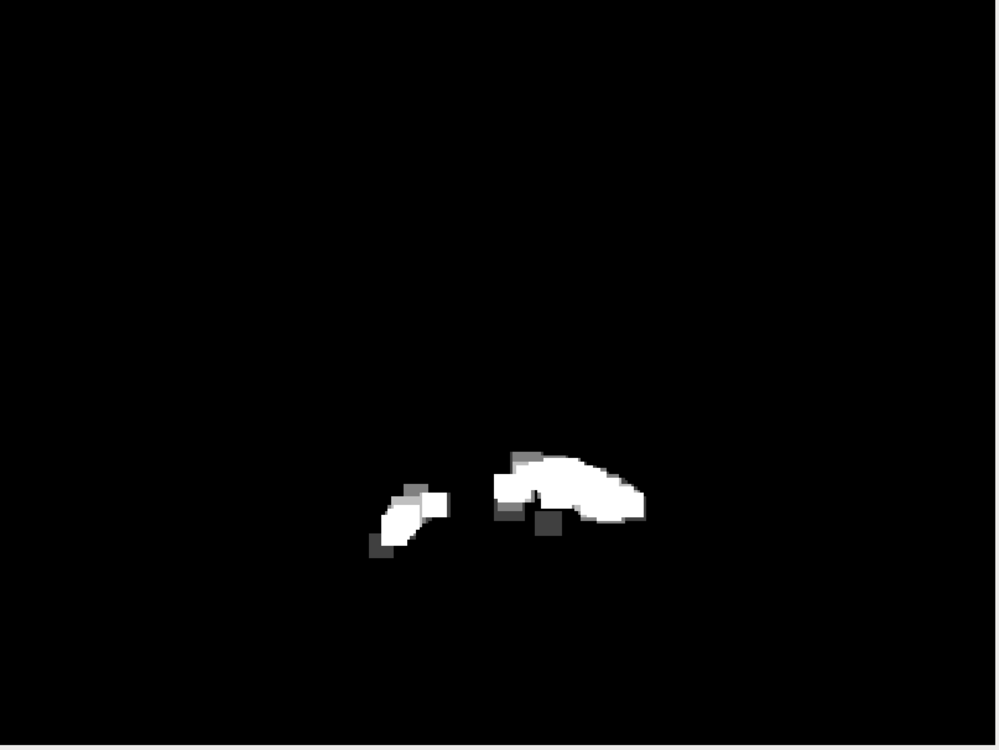
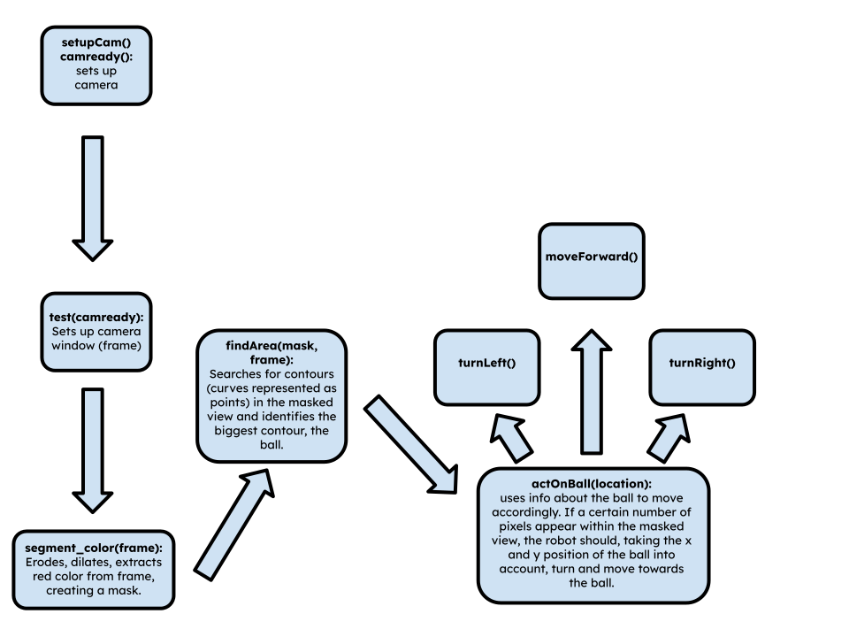

# Ball Tracking Robot

My project, the ball tracking robot, uses a combination of a Raspberry Pi, an ultrasonic sensor, and OpenCV to detect the presence of a red ball in the field of view of a camera and move towards it, navigating around obstacles. This project has potential applications in competitive robotics, as well as with robots that need to move towards a certain target, such as a person for rescue or delivery.


| **Engineer** | **School** | **Area of Interest** | **Grade** |
|:--:|:--:|:--:|:--:|
| Kavin V | Stratford Preparatory | Electrical Engineering | Incoming Freshman



  
# Final Milestone

<iframe width="560" height="315" src="https://www.youtube.com/embed/QO7vKPxlNC4?si=Abst_qLvoBDKtjux" title="YouTube video player" frameborder="0" allow="accelerometer; autoplay; clipboard-write; encrypted-media; gyroscope; picture-in-picture; web-share" referrerpolicy="strict-origin-when-cross-origin" allowfullscreen></iframe>

For my third and final milestone, I had to put ultrasonic sensors on my robot to detect obstacles and move around them. Future work would incorporate this into my whole robot, This milestone is only the wiring and write sensor testing code. 

The ultrasonic sensors, in order to detect obstacles, output a wave of sound at a frequency inaudible to humans. At the same time, my code gets the current time in seconds. When the sound wave bounces off a surface and is recieved back by the ultrasonic sensor, the sensor will output a signal to the Raspberry Pi, which will record the current time again. The time when the wave was cast is subtracted from the time the wave came back to the sensor, then multiplied by the speed of sound (34300 cm/s) to find the distance from the sensor (which is on the robot) to the obstacle (distance = speed * time.) 

The sensor has 4 pins: 
1. VCC for power (it takes 5V from the Raspberry Pi), 
2. trig (meaning trigger -- if this pin receives an input, the sensor will cast a sound wave), 
3. echo (which will output 5V when the sound wave is received back), 
4. and gnd (ground, which connects to the Raspberry Pi's ground to make a complete circuit.) 

I used a breadboard to organize my wiring. I also needed it because the ultrasonic sensor's echo pin outputs 5 volts, which would fry the Raspberry Pi if outputted directly to it. I had to create voltage dividers on the breadboard to reduce the voltage to 3.3V, which the Raspberry Pi can handle, and then add another wire back to the GPIO pins of the Raspberry Pi. 


**Figure 1: A schematic showing the wiring of the ultrasonic sensors and voltage dividers**

I faced a few challenges during this milestone. For one, my ultrasonic sensors would randomly stop and start working without explanation. I also had trouble understanding the concept of voltage dividers. However, I'm still happy I managed to do all of this in three days.

My biggest challenges at BSE were mostly related to my inexperience with both the hardware and software aspects of my project. I barely knew how to code, and I didn't have any experience with designing circuits and wiring, major parts of my first and final milestones. However, with the help of online resources, I was able to push through. Other challenges I faced were ssh and VNC, the two methods I used to remotely access my raspberry pi, constantly breaking. My raspberry pi’s SD card was also corrupted twice, making me have to restart parts of my milestones. Although I wasn’t able to finish my third milestone, and potential modifications, such as image recognition, a package holder, and circle detection for the ball. I am happy with what I accomplished at Bluestamp.

Bluestamp has given me exposure to practical engineering, and equipped me with many new engineering skills. In the future, I want to explore more robotics and other fields of engineering, such as medical engineering, and utilize any opportunity to do so. Overall, Bluestamp was a great experience, and I took a lot away from it. 

Here's my code to test the ultrasonic sensors:

```python
import RPi.GPIO as GPIO
import time

GPIO.setmode(GPIO.BCM)

trigRight = 27
echoRight = 17

trigFront = 6
echoFront = 13

trigLeft = 22
echoLeft = 5

GPIO.setup(trigRight, GPIO.OUT)
GPIO.setup(echoRight, GPIO.IN)

GPIO.setup(trigLeft, GPIO.OUT)
GPIO.setup(echoLeft, GPIO.IN)

GPIO.setup(trigFront, GPIO.OUT)
GPIO.setup(echoFront, GPIO.IN)

try:
    while True:
        GPIO.output(trigRight, GPIO.LOW)
        GPIO.output(trigLeft, GPIO.LOW)
        GPIO.output(trigFront, GPIO.LOW)
        
        time.sleep(2)
        
        GPIO.output(trigRight, GPIO.HIGH)
        GPIO.output(trigLeft, GPIO.HIGH) 
        GPIO.output(trigFront, GPIO.HIGH)
        
        time.sleep(0.00001)
        
        GPIO.output(trigRight, GPIO.LOW)
        GPIO.output(trigLeft, GPIO.LOW)
        GPIO.output(trigFront, GPIO.LOW)

        pulseOutRight, pulseOutLeft, pulseOutFront = None, None, None
        pulseInRight, pulseInLeft, pulseInFront = None, None, None

        while GPIO.input(echoRight) == 0:
            pulseOutRight = time.time()
        while GPIO.input(echoLeft) == 0:
            pulseOutLeft = time.time()
        while GPIO.input(echoFront) == 0:
            pulseOutFront = time.time()

        while GPIO.input(echoRight) == 1:
            pulseInRight = time.time()
        while GPIO.input(echoLeft) == 1:
            pulseInLeft = time.time()
        while GPIO.input(echoFront) == 1:
            pulseInFront = time.time()

        if pulseOutRight is not None and pulseInRight is not None:
            pulseRight = (pulseInRight - pulseOutRight) / 2
            distanceRight = 34300 * pulseRight  # speed of sound (cm/s) = 34300
            distanceRight = round(distanceRight, 2)
            print("Object is at", distanceRight, "cm from the right ultrasonic sensor")

        if pulseOutLeft is not None and pulseInLeft is not None:
            pulseLeft = (pulseInLeft - pulseOutLeft) / 2
            distanceLeft = 34300 * pulseLeft
            distanceLeft = round(distanceLeft, 2)
            print("Object is at", distanceLeft, "cm from the left ultrasonic sensor")

        if pulseOutFront is not None and pulseInFront is not None:
            pulseFront = (pulseInFront - pulseOutFront) / 2
            distanceFront = 34300 * pulseFront
            distanceFront = round(distanceFront, 2)
            print("Object is at", distanceFront, "cm from the front ultrasonic sensor")

except KeyboardInterrupt:
    print("Stopped")

finally:
    GPIO.cleanup()
```


# Second Milestone

<iframe width="560" height="315" src="https://www.youtube.com/embed/DaMwDQAP_oo?si=SPBSliBHyFMb3oEt" title="YouTube video player" frameborder="0" allow="accelerometer; autoplay; clipboard-write; encrypted-media; gyroscope; picture-in-picture; web-share" referrerpolicy="strict-origin-when-cross-origin" allowfullscreen></iframe>
For my second milestone, I had to attach a camera to my raspberry pi and use it to set up a ball tracking algorithm. This required: 
1. Mounting the camera on the robot, 
2. Connecting it to the raspberry pi, 
3. Installing several libraries for the camera,
4. And writing an algorithm that would detect the ball by color and size, and turn and move towards it when sighted.


I also added the switch to my circuit, which I had originally planned to do in milestone 1. This was helpful in making sure I didn't have to manually disconnect and reconnect my circuit to conserve battery. 

A ribbon cable connnects the camera, which is glued onto the motor base, to the Raspberry Pi. The Raspberry Pi interfaces with the camera using the picamera2 library. It also uses the OpenCV computer vision library to erode and dilate the camera view in order to isolate the ball, then puts a mask over the camera view that extracts only the red color of the ball. 

| **Original** | **Eroded and Dilated** | **Masked** | 
|:--:|:--:|:--:|
|  |  |  |

**Figure 2: Comparison of the different stages of processing that the camera view goes through**

From this masked image, the x and y coordinates of the ball can be found. If the coordinates are near the center of the camera view, the robot moves forward. Otherwise, depending on if the ball is on the left or right, the robot will turn towards the ball until the ball is centered in the camera view, then move forward. If the ball suddenly disappears from the camera view, the robot will take the last seen x and y of the ball, and depending on where that is in the camera view, turn left or right, searching for the ball. The Raspberry Pi's GPIO pins are connected to the motors through a driver, and different functions are called to set these pins to high to turn on different motors.



**Figure 3: A flowchart showing my code's logic** 

This milestone, being almost entirely software-based, came with many setbacks. My Raspberry Pi's micro-SD card was corrupted twice after its power randomly switched back off and on, requiring me to set up the Raspberry Pi multiple times, consuming a lot of my time. The Raspberry Pi's ssh and VNC also kept breaking, making me switch to using OBS with a video capture card, HDMI cable, mouse, and keyboard. In addition, I had trouble finding what I needed in the documentation for both OpenCV and picamera2 due to inexperience with this and coding in general. I ran into a glitch near the end of completing this milestone where my code would run without errors, but the motors would not turn; this took several days to solve. 

This is my code:

```python

import cv2
import numpy as np
import RPi.GPIO as GPIO
from picamera2 import Picamera2, Preview, MappedArray
import time

# set up motors; this needs to be global for move functions to work and so is outside a function

GPIO.setmode(GPIO.BCM) # set the way that the GPIO pins are referred to in the code

motor1B = 23
motor1E = 24
ena = 25

motor2B = 26
motor2E = 16
enb = 12

GPIO.setup(motor1B, GPIO.OUT)
GPIO.setup(motor1E, GPIO.OUT)
GPIO.setup(ena, GPIO.OUT)

GPIO.setup(motor2B, GPIO.OUT)
GPIO.setup(motor2E, GPIO.OUT)
GPIO.setup(enb, GPIO.OUT)

pwmA = GPIO.PWM(ena, 100)
pwmB = GPIO.PWM(enb, 100)
pwmA.start(60)
pwmB.start(60)

#return motor1B, motor1E, motor2B, motor2E, ena, enb

def setupCam():
    print ("in setupCam")
    picam2 = Picamera2() # allows Picamera2 to be referred to as picam2

    def preview(request):
            with MappedArray(request, "main") as m: # put other code to retrieve 'main'
                    pass

    picam2.pre_callback = preview             

    time.sleep(1) # wait 1 second

    picam2.start(show_preview=True) # starts the camera along a live preview window

    return picam2

def test(picam2):
    print ("in test")
    while True:
        frame = picam2.capture_array() # captures one image using camera
        segmentColor(frame)

def segmentColor(frame):    #creates a mask over 'frame' with only the ball's color coming through
    print ("in segment_colour")
    rgb =  cv2.cvtColor(frame, cv2.COLOR_BGR2RGB)
    
    mask_1 = cv2.inRange(rgb, np.array([50,40,170]), np.array([100,70,240])) # range of RGB values to appear through the mask

    mask = mask_1 
    
    kern_dilate = np.ones((8,8),np.uint8)
    kern_erode  = np.ones((3,3),np.uint8)
    
    frame = cv2.resize(frame, (320, 240))
    
    mask = cv2.resize(mask, (320, 240)) # resize to reduce resolution/improve performance
    mask= cv2.erode(mask,kern_erode)      # erode to approximate color
    mask=cv2.dilate(mask,kern_dilate)     # dilate to blur
    
    (h,w) = mask.shape
    
    cv2.imshow('frame',frame)
    cv2.imshow('mask', mask)              # Shows mask (B&W frame with identified red pixels) 
    
    findArea(mask, frame)
    
    return mask, frame
    

def findArea(mask, frame): # find largest red object within the mask
    print ("in findArea")
    contours, hierarchy = cv2.findContours(mask, cv2.RETR_CCOMP, cv2.CHAIN_APPROX_SIMPLE)
    
    biggestContour = 0.0
    contour_index = 0
    
    for idx, contour in enumerate(contours): # find the biggest contours in the masked
        area = cv2.contourArea(contour)
        if area > biggestContour:
            biggestContour = area
            contour_index = idx

    location=(0,0,2,2)
    if len(contours) > 0: # if contours are in the masked view, find their x and y
        location = cv2.boundingRect(contours[contour_index])
    
    lastSeenX = 0
    lastSeenY = 0

    actOnBall(location, lastSeenX, lastSeenY)

    return None


def actOnBall(location, lastSeenX, lastSeenY):
    print ("in actOnBall")
    x, y, width, height = location 
    
    print("x:"+str(x))
    print("y:"+str(y))
    
    if (width*height) > 300:
        print ("ball")
        if x<=160:
            if 130<x<190:
                pass
            else:
                # turn left until ball centered
                print ("in turn left")
                turnLeft()

        else:
            # turn right until ball centered
            if 130<x<190:
                pass
            else:
                print ("in turn right")
                turnRight()
        # move forward until contour area greater than a certain amount
        moveForward()
        if (width*height)>= 800: # if the size of the ball in the camera feed is big enough, stop
            pass
        else:        
            if lastSeenX<=320:
                turnLeft()
            else:
                turnRight()
        
    else:
        print("no ball")
        lastSeenX = x
        lastSeenY = y
    
def turnRight(motor1B=23, motor1E=24, motor2B=26, motor2E=16):
    print ("in turnRight")
    GPIO.output(motor1B,GPIO.HIGH) 
    GPIO.output(motor1E, GPIO.LOW) 

    GPIO.output(motor2B, GPIO.LOW) 
    GPIO.output(motor2E, GPIO.LOW)
    print("----------------")
    time.sleep(0.05)
    
def turnLeft(motor1B=23, motor1E=24, motor2B=26, motor2E=16):
    print ("in turnLeft")
    GPIO.output(motor1B,GPIO.LOW) 
    GPIO.output(motor1E, GPIO.LOW) 

    GPIO.output(motor2B, GPIO.HIGH) 
    GPIO.output(motor2E, GPIO.LOW)
    print("----------------")
    time.sleep(0.05)
    
def moveBackward(motor1B=23, motor1E=24, motor2B=26, motor2E=16):
    print ("in moveForward")
    GPIO.output(motor1B,GPIO.HIGH) 
    GPIO.output(motor1E, GPIO.LOW) 

    GPIO.output(motor2B, GPIO.HIGH) 
    GPIO.output(motor2E, GPIO.LOW)
    print("----------------")
    time.sleep(0.1)
    
def moveForward(motor1B=23, motor1E=24, motor2B=26, motor2E=16):
    print ("in moveBackward")
    GPIO.output(motor1E,GPIO.HIGH) 
    GPIO.output(motor1B, GPIO.LOW) 

    GPIO.output(motor2E, GPIO.HIGH) 
    GPIO.output(motor2B, GPIO.LOW)
    print("----------------")
    time.sleep(0.1)
    
while True:

    camready = setupCam()
    test(camready)
    
    if cv2.waitKey(1) & 0xff == ord('q'): # if key q pressed, break loop to close all windows
        break

cv2.destroyAllWindows()

```

# First Milestone

<iframe width="560" height="315" src="https://www.youtube.com/embed/dIZvc5pAWbs?si=-mbjczFO7UeUTKnD" title="YouTube video player" frameborder="0" allow="accelerometer; autoplay; clipboard-write; encrypted-media; gyroscope; picture-in-picture; web-share" referrerpolicy="strict-origin-when-cross-origin" allowfullscreen></iframe>

In my first milestone, I got the motors to turn on my robot. 
This involved: 
1. Constructing the base of the robot, 
2. Configuring the Raspberry Pi to work with ssh and the app VNC Viewer on my laptop for remote control,
3. Attaching the motors to the motor driver and Raspberry Pi,
4. And running basic code in Python to ensure the functionality of the components.

The base of the robot is made up of several components: two DC motors, a plastic base plate with holes for screws to attach parts, a 6 volt battery pack, two wheels to screw onto the chassis of the motors, a switch, and one more wheel that attaches to one end of the robot, and can rotate back and forth depending on the motion of the robot, providing stability. Screws hold these parts in place on the baseplate. Remaining space on the baseplate allows for additional components, such as a motor driver and Raspberry Pi, to be attached.


**Figure 4: A schematic showing the state of my robot as of the first milestone**

Power goes from the battery pack to the H-bridge motor driver (which serves as a terminal to toggle and redirect power) through the "5V" input slot. The motor driver requires at least 5 volts to power its own processor to redirect power. Output slots are used to connect the motors to the H-bridge. The H-bridge also has input pins, which can receive instructions from another device such as a Raspberry Pi to toggle power to certain output slots. The Raspberry Pi has GPIO (general purpose input-output) pins on it, which can receive and output instructions to and from another device. The pins of the two devices are connected via jumper wires, allowing for code on the Raspberry Pi to control the motor driver.

The motor driver has 6 input pins: ENA, ENB, IN1, IN2, IN3, and IN4. ENA and ENB stand for Enable Motor A and B. Each pin provides instructions for whether or not the motors should be turned on from the Raspberry Pi. These pins must be digital pins capable of outputting code instructions in the form of PWM (pulse width modulation) instructions, which tell the H-bridge what the duty cycle (or fraction of a certain period of time) the power should be turned on and at what strength in a format that the H-Bridge understands. The IN (input) pins provide a way for the Raspberry Pi to give instructions to the H-Bridge on the direction of the motor, and are connected to additional GPIO pins. The circuit is completed by connecting the ground of the Raspberry Pi to the ground of the H-bridge and battery pack.

I faced challenges with implementing the switch; I couldn't solder it to my wires effectively, so I decided to leave it out and instead, for now, just disconnected the power to turn off the robot. The electrical engineering aspect of this milestone was also completely new to me, so I struggled with this; however, I was able to push through by learning what I needed to online. The Raspberry Pi also kept bugging out and not working with ssh and VNC Viewer, making me have to attach the Raspberry Pi to a monitor, mouse, and keyboard to use it. So far, I haven't been able to find the cause of this problem.

In my next milestone, the robot will have a camera, and be able to recognize and move towards a red ball. 

Here's my code for testing the motors:

```python

import  RPi.GPIO as GPIO
import time

GPIO.setmode(GPIO.BCM) 

MOTOR1B = 23
MOTOR1E = 24
ena = 25

MOTOR2B = 16
MOTOR2E = 26
enb = 12

GPIO.setup(MOTOR1B, GPIO.OUT)
GPIO.setup(MOTOR1E, GPIO.OUT)
GPIO.setup(ena, GPIO.OUT)

GPIO.setup(MOTOR2B, GPIO.OUT)
GPIO.setup(MOTOR2E, GPIO.OUT)
GPIO.setup(enb, GPIO.OUT)

pwmA = GPIO.PWM(ena, 100)
pwmB = GPIO.PWM(enb, 100)
pwmA.start(60)
pwmB.start(60)

GPIO.output(MOTOR1B,GPIO.HIGH)
GPIO.output(MOTOR1E, GPIO.LOW)

GPIO.output(MOTOR2B, GPIO.HIGH)
GPIO.output(MOTOR2E, GPIO.LOW)
time.sleep(10)

```

# Schematics


# Code
```python


import cv2
import numpy as np
import RPi.GPIO as GPIO
from picamera2 import Picamera2, Preview, MappedArray
import time

# set up motors; this needs to be global for move functions to work and so is outside a function

GPIO.setmode(GPIO.BCM) # set the way that the GPIO pins are referred to in the code

motor1B = 23
motor1E = 24
ena = 25

motor2B = 26
motor2E = 16
enb = 12

GPIO.setup(motor1B, GPIO.OUT)
GPIO.setup(motor1E, GPIO.OUT)
GPIO.setup(ena, GPIO.OUT)

GPIO.setup(motor2B, GPIO.OUT)
GPIO.setup(motor2E, GPIO.OUT)
GPIO.setup(enb, GPIO.OUT)

pwmA = GPIO.PWM(ena, 100)
pwmB = GPIO.PWM(enb, 100)
pwmA.start(60)
pwmB.start(60)

def setupCam():
    print ("in setupCam")
    picam2 = Picamera2() # allows Picamera2 to be referred to as picam2

    def preview(request):
            with MappedArray(request, "main") as m: # put other code to retrieve 'main'
                    pass

    picam2.pre_callback = preview             

    time.sleep(1) # wait 1 second

    picam2.start(show_preview=True) # starts the camera along a live preview window

    return picam2

def test(picam2):
    print ("in test")
    while True:
        frame = picam2.capture_array() # captures one image using camera
        segmentColor(frame)

def segmentColor(frame):    #creates a mask over 'frame' with only the ball's color coming through
    print ("in segment_colour")
    rgb =  cv2.cvtColor(frame, cv2.COLOR_BGR2RGB)
    
    mask_1 = cv2.inRange(rgb, np.array([50,40,170]), np.array([100,70,240])) # range of RGB values to appear through the mask

    mask = mask_1 
    
    kern_dilate = np.ones((8,8),np.uint8)
    kern_erode  = np.ones((3,3),np.uint8)
    
    frame = cv2.resize(frame, (320, 240))
    
    mask = cv2.resize(mask, (320, 240)) # resize to reduce resolution/improve performance
    mask= cv2.erode(mask,kern_erode)      # erode to approximate color
    mask=cv2.dilate(mask,kern_dilate)     # dilate to blur
    
    (h,w) = mask.shape
    
    cv2.imshow('frame',frame)
    cv2.imshow('mask', mask)              # Shows mask (B&W frame with identified red pixels) 
    
    findArea(mask, frame)
    
    return mask, frame
    

def findArea(mask, frame): # find largest red object within the mask
    print ("in findArea")
    contours, hierarchy = cv2.findContours(mask, cv2.RETR_CCOMP, cv2.CHAIN_APPROX_SIMPLE)
    
    biggestContour = 0.0
    contour_index = 0
    
    for idx, contour in enumerate(contours): # find the biggest contours in the masked
        area = cv2.contourArea(contour)
        if area > biggestContour:
            biggestContour = area
            contour_index = idx

    location=(0,0,2,2)
    if len(contours) > 0: # if contours are in the masked view, find their x and y
        location = cv2.boundingRect(contours[contour_index])
    
    lastSeenX = 0
    lastSeenY = 0

    actOnBall(location, lastSeenX, lastSeenY)

    return None


def actOnBall(location, lastSeenX, lastSeenY):
    print ("in actOnBall")
    x, y, width, height = location 
    
    print("x:"+str(x))
    print("y:"+str(y))
    
    if (width*height) > 300:
        print ("ball")
        if x<=160:
            if 130<x<190:
                pass
            else:
                # turn left until ball centered
                print ("in turn left")
                turnLeft()

        else:
            # turn right until ball centered
            if 130<x<190:
                pass
            else:
                print ("in turn right")
                turnRight()
        # move forward until contour area greater than a certain amount
        moveForward()
        if (width*height)>= 800: # if the size of the ball in the camera feed is big enough, stop
            pass
        else:        
            if lastSeenX<=320:
                turnLeft()
            else:
                turnRight()
        
    else:
        print("no ball")
        lastSeenX = x
        lastSeenY = y
    
def turnRight(motor1B=23, motor1E=24, motor2B=26, motor2E=16):
    print ("in turnRight")
    GPIO.output(motor1B,GPIO.HIGH) 
    GPIO.output(motor1E, GPIO.LOW) 

    GPIO.output(motor2B, GPIO.LOW) 
    GPIO.output(motor2E, GPIO.LOW)
    print("----------------")
    time.sleep(0.05)
    
def turnLeft(motor1B=23, motor1E=24, motor2B=26, motor2E=16):
    print ("in turnLeft")
    GPIO.output(motor1B,GPIO.LOW) 
    GPIO.output(motor1E, GPIO.LOW) 

    GPIO.output(motor2B, GPIO.HIGH) 
    GPIO.output(motor2E, GPIO.LOW)
    print("----------------")
    time.sleep(0.05)
    
def moveBackward(motor1B=23, motor1E=24, motor2B=26, motor2E=16):
    print ("in moveForward")
    GPIO.output(motor1B,GPIO.HIGH) 
    GPIO.output(motor1E, GPIO.LOW) 

    GPIO.output(motor2B, GPIO.HIGH) 
    GPIO.output(motor2E, GPIO.LOW)
    print("----------------")
    time.sleep(0.1)
    
def moveForward(motor1B=23, motor1E=24, motor2B=26, motor2E=16):
    print ("in moveBackward")
    GPIO.output(motor1E,GPIO.HIGH) 
    GPIO.output(motor1B, GPIO.LOW) 

    GPIO.output(motor2E, GPIO.HIGH) 
    GPIO.output(motor2B, GPIO.LOW)
    print("----------------")
    time.sleep(0.1)
    
while True:
    camready = setupCam()
    test(camready)
    
    if cv2.waitKey(0) import cv2
import numpy as np
import RPi.GPIO as GPIO
from picamera2 import Picamera2, Preview, MappedArray
import time

# set up motors; this needs to be global for move functions to work and so is outside a function

GPIO.setmode(GPIO.BCM) # set the way that the GPIO pins are referred to in the code

motor1B = 23
motor1E = 24
ena = 25

motor2B = 26
motor2E = 16
enb = 12

GPIO.setup(motor1B, GPIO.OUT)
GPIO.setup(motor1E, GPIO.OUT)
GPIO.setup(ena, GPIO.OUT)

GPIO.setup(motor2B, GPIO.OUT)
GPIO.setup(motor2E, GPIO.OUT)
GPIO.setup(enb, GPIO.OUT)

pwmA = GPIO.PWM(ena, 100)
pwmB = GPIO.PWM(enb, 100)
pwmA.start(60)
pwmB.start(60)

#return motor1B, motor1E, motor2B, motor2E, ena, enb

def setupCam():
    print ("in setupCam")
    picam2 = Picamera2() # allows Picamera2 to be referred to as picam2

    def preview(request):
            with MappedArray(request, "main") as m: # put other code to retrieve 'main'
                    pass

    picam2.pre_callback = preview             

    time.sleep(1) # wait 1 second

    picam2.start(show_preview=True) # starts the camera along a live preview window

    return picam2

def test(picam2):
    print ("in test")
    while True:
        frame = picam2.capture_array() # captures one image using camera
        segmentColor(frame)

def segmentColor(frame):    #creates a mask over 'frame' with only the ball's color coming through
    print ("in segment_colour")
    rgb =  cv2.cvtColor(frame, cv2.COLOR_BGR2RGB)
    
    mask_1 = cv2.inRange(rgb, np.array([50,40,170]), np.array([100,70,240])) # range of RGB values to appear through the mask

    mask = mask_1 
    
    kern_dilate = np.ones((8,8),np.uint8)
    kern_erode  = np.ones((3,3),np.uint8)
    
    frame = cv2.resize(frame, (320, 240))
    
    mask = cv2.resize(mask, (320, 240)) # resize to reduce resolution/improve performance
    mask= cv2.erode(mask,kern_erode)      # erode to approximate color
    mask=cv2.dilate(mask,kern_dilate)     # dilate to blur
    
    (h,w) = mask.shape
    
    cv2.imshow('frame',frame)
    cv2.imshow('mask', mask)              # Shows mask (B&W frame with identified red pixels) 
    
    findArea(mask, frame)
    
    return mask, frame
    

def findArea(mask, frame): # find largest red object within the mask
    print ("in findArea")
    contours, hierarchy = cv2.findContours(mask, cv2.RETR_CCOMP, cv2.CHAIN_APPROX_SIMPLE)
    
    biggestContour = 0.0
    contour_index = 0
    
    for idx, contour in enumerate(contours): # find the biggest contours in the masked
        area = cv2.contourArea(contour)
        if area > biggestContour:
            biggestContour = area
            contour_index = idx

    location=(0,0,2,2)
    if len(contours) > 0: # if contours are in the masked view, find their x and y
        location = cv2.boundingRect(contours[contour_index])
    
    lastSeenX = 0
    lastSeenY = 0

    actOnBall(location, lastSeenX, lastSeenY)

    return None


def actOnBall(location, lastSeenX, lastSeenY):
    print ("in actOnBall")
    x, y, width, height = location 
    
    print("x:"+str(x))
    print("y:"+str(y))
    
    if (width*height) > 300:
        print ("ball")
        if x<=160:
            if 130<x<190:
                pass
            else:
                # turn left until ball centered
                print ("in turn left")
                turnLeft()

        else:
            # turn right until ball centered
            if 130<x<190:
                pass
            else:
                print ("in turn right")
                turnRight()
        # move forward until contour area greater than a certain amount
        moveForward()
        if (width*height)>= 800: # if the size of the ball in the camera feed is big enough, stop
            pass
        else:        
            if lastSeenX<=320:
                turnLeft()
            else:
                turnRight()
        
    else:
        print("no ball")
        lastSeenX = x
        lastSeenY = y
    
def turnRight(motor1B=23, motor1E=24, motor2B=26, motor2E=16):
    print ("in turnRight")
    GPIO.output(motor1B,GPIO.HIGH) 
    GPIO.output(motor1E, GPIO.LOW) 

    GPIO.output(motor2B, GPIO.LOW) 
    GPIO.output(motor2E, GPIO.LOW)
    print("----------------")
    time.sleep(0.05)
    
def turnLeft(motor1B=23, motor1E=24, motor2B=26, motor2E=16):
    print ("in turnLeft")
    GPIO.output(motor1B,GPIO.LOW) 
    GPIO.output(motor1E, GPIO.LOW) 

    GPIO.output(motor2B, GPIO.HIGH) 
    GPIO.output(motor2E, GPIO.LOW)
    print("----------------")
    time.sleep(0.05)
    
def moveBackward(motor1B=23, motor1E=24, motor2B=26, motor2E=16):
    print ("in moveForward")
    GPIO.output(motor1B,GPIO.HIGH) 
    GPIO.output(motor1E, GPIO.LOW) 

    GPIO.output(motor2B, GPIO.HIGH) 
    GPIO.output(motor2E, GPIO.LOW)
    print("----------------")
    time.sleep(0.1)
    
def moveForward(motor1B=23, motor1E=24, motor2B=26, motor2E=16):
    print ("in moveBackward")
    GPIO.output(motor1E,GPIO.HIGH) 
    GPIO.output(motor1B, GPIO.LOW) 

    GPIO.output(motor2E, GPIO.HIGH) 
    GPIO.output(motor2B, GPIO.LOW)
    print("----------------")
    time.sleep(0.1)
    
while True:

    camready = setupCam()
    test(camready)
    
    if cv2.waitKey(1) & 0xff == ord('q'): # if key q pressed, break loop to close all windows
        break

cv2.destroyAllWindows()

``` 

# Bill of Materials

| **Part** | **Note** | **Price** | **Link** |
|:--:|:--:|:--:|:--:|
| Canakit Raspberry Pi 4 4GB Starter Kit - 32GB | Used to control and deploy code on the robot | $119.95 | <a href="https://www.canakit.com/raspberry-pi-4-starter-kit.html"> Link </a> |
| L298N H-Bridge Motor Driver | Used to output PWM signals from Raspberry Pi to motors | $6.99 | <a href="https://www.amazon.com/Qunqi-Controller-Module-Stepper-Arduino/dp/B014KMHSW6/"> Link </a> |
| Arducam 5MP OV5647 Camera | Used for detection of the ball by color | $8.99 | <a href="https://www.uctronics.com/arducam-for-raspberry-pi-camera-module-with-case-5mp-1080p-for-raspberry-pi-3-3-b-and-more.html"> Link </a> |
| HC-SR04 Ultrasonic Sensor (3) | Used for obstacle detection | $13.50 | <a href="https://www.sparkfun.com/products/15569"> Link </a> |
| Emozny 2-Wheel Robot Car Kit | Is the base of the robot and includes the motors and wheels for movement | $12.99 | <a href="https://www.amazon.com/Smart-Chassis-Motors-Encoder-Battery/dp/B01LXY7CM3"> Link </a> |
| Breadboard | To organize wiring and create voltage dividers | $5.00 | <a href="https://www.adafruit.com/product/4539"> Link </a> |
| AA Batteries | To power the motors | $6.64 | <a href="https://www.amazon.com/AmazonBasics-Performance-Alkaline-Batteries-8-Pack/dp/B00O869KJE/"> Link </a> |
| INIU Power Bank | To power the Raspberry Pi | $22.99 | <a href="https://www.amazon.com/INIU-High-Speed-Flashlight-Powerbank-Compatible/dp/B07CZDXDG8?th=1"> Link </a> | 

# Resources:
https://learn.adafruit.com/python-virtual-environment-usage-on-raspberry-pi/basic-venv-usage

https://docs.opencv.org/3.4/d6/d00/tutorial_py_root.html

https://www.engineersgarage.com/opencv4-5-raspberry-pi-image-video-access-recording/


# Starter Project: RGB Sliders

<iframe width="560" height="315" src="https://www.youtube.com/embed/Xfu9-YYEO8g?si=NT8ErERu6xz7UEhm" title="YouTube video player" frameborder="0" allow="accelerometer; autoplay; clipboard-write; encrypted-media; gyroscope; picture-in-picture; web-share" referrerpolicy="strict-origin-when-cross-origin" allowfullscreen></iframe>

My starter project was the RGB Sliders, which I chose because I thought a customizable light would look cool, and I’d learn a lot from the slider mechanism. The device has three 7-pin sliders for different colors, red, green, and blue, which control the color of a 4-pin LED light, a board for the components, and a micro-USB port for power. The LED contains three diodes, devices that allow current to flow in one direction, made of silicon semiconductors, that each emit different wavelengths of color. This is due to electricity emitting photons of different wavelengths on the visible spectrum – red, green, and blue. Each diode is manufactured a certain way to emit a certain wavelength of light. The different diodes are concentrated close together enough that the illusion of the LED emitting one singular color is created, as the colors from the different diodes appear to blend together.

Current flows from the micro-USB port to the sliders, which control the flow of current to capacitors. These capacitors control the amount of power the diodes recieve and so their brightness. For example, if the green slider were set to 0 and the red and blue sliders each set to max, the green diode would not light up, while both the red and blue ones would be at full brightness. The red and blue would appear to blend together to create the color purple. 


**Figure 5: A diagram showing the internal circuits of the RGB Sliders**

I found this project mostly easy to put together, as I just had to solder the sliders and LED to the board. However, I encountered a problem with the green color slider where it did not work. At first, I thought this was a problem with the slider not being soldered properly to the board, and added more solder to the pins. Later, though, I realized that the LED was positioned incorrectly. I attempted to desolder it, but was mostly unsuccessful, so instead kept melting the solder and slightly adjusting the angle of the LED until it worked.

Product used:  <a href="https://www.amazon.com/Soldering-Practice-Learning-Electronics-Training/dp/B0BKM3D927"> Link </a> 
