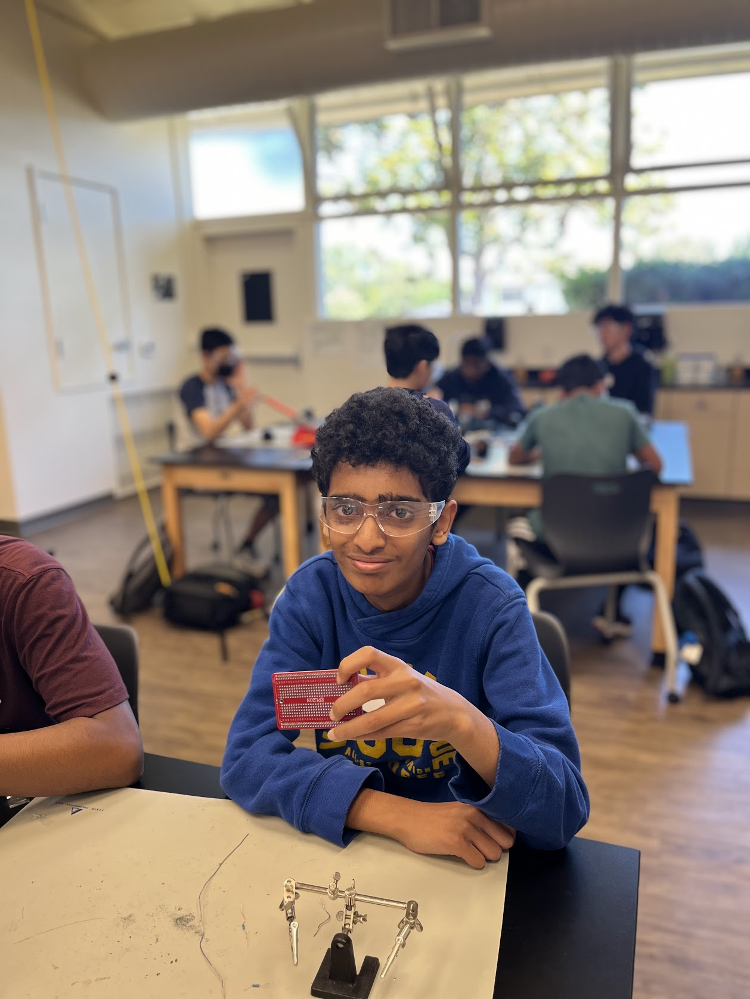
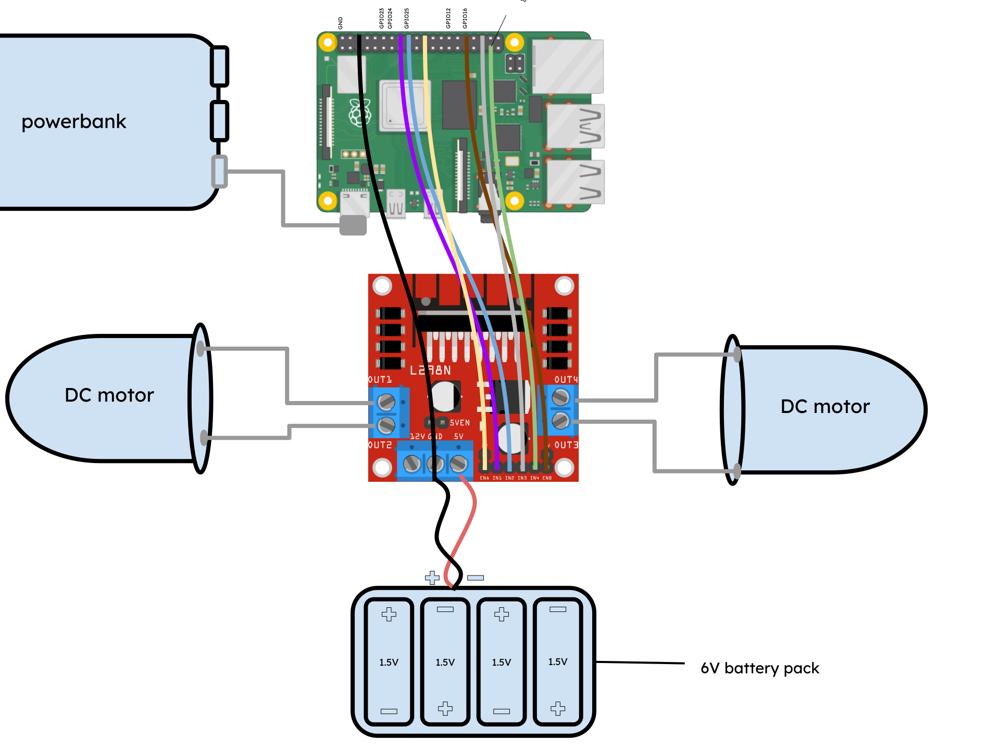
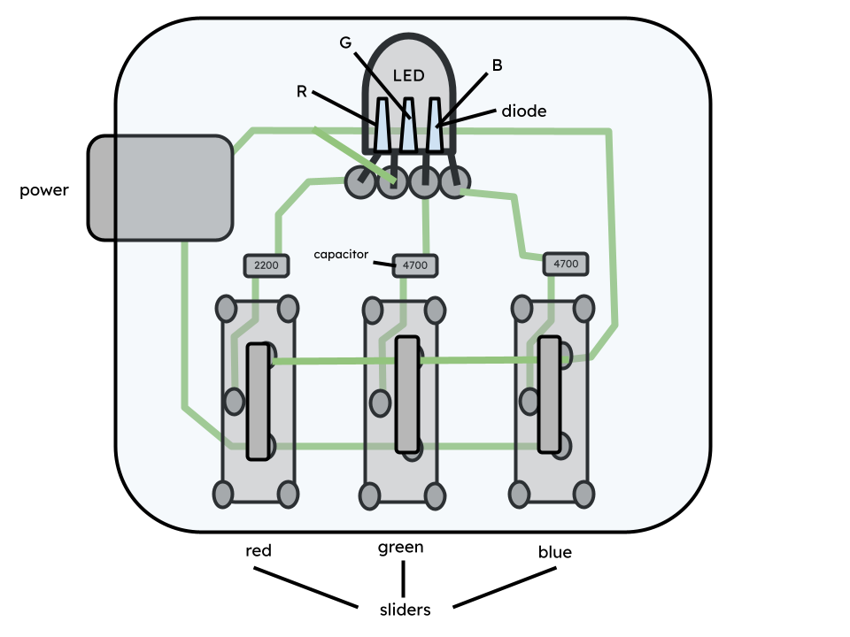

# Ball Tracking Robot

My project, the ball tracking robot, uses a combination of a Raspberry Pi, an ultrasonic sensor, and OpenCV to detect the presence of a red ball in the field of view of a camera and move towards it, navigating around obstacles. This project has potential applications in competitive robotics, as well as with robots that need to move towards a certain target, such as a person for rescue or delivery.
 
<!--- Replace this text with a brief description (2-3 sentences) of your project. This description should draw the reader in and make them interested in what you've built. You can include what the biggest challenges, takeaways, and triumphs from completing the project were. As you complete your portfolio, remember your audience is less familiar than you are with all that your project entails! -->


<!--- You should comment out all portions of your portfolio that you have not completed yet, as well as any instructions: --->


| **Engineer** | **School** | **Area of Interest** | **Grade** |
|:--:|:--:|:--:|:--:|
| Kavin V | Stratford Preparatory | Electrical Engineering | Incoming Freshman

<!--- **Replace the BlueStamp logo below with an image of yourself and your completed project. Follow the guide [here](https://tomcam.github.io/least-github-pages/adding-images-github-pages-site.html) if you need help.** --->


  
<!--- # Final Milestone --->

<!--- **Don't forget to replace the text below with the embedding for your milestone video. Go to Youtube, click Share -> Embed, and copy and paste the code to replace what's below.** --->

<!--- <iframe width="560" height="315" src="https://www.youtube.com/embed/F7M7imOVGug" title="YouTube video player" frameborder="0" allow="accelerometer; autoplay; clipboard-write; encrypted-media; gyroscope; picture-in-picture; web-share" allowfullscreen></iframe> --->

<!--- For your final milestone, explain the outcome of your project. Key details to include are:
- What you've accomplished since your previous milestone
- What your biggest challenges and triumphs were at BSE
- A summary of key topics you learned about
- What you hope to learn in the future after everything you've learned at BSE --->


<!--- # Second Milestone --->

<!--- **Don't forget to replace the text below with the embedding for your milestone video. Go to Youtube, click Share -> Embed, and copy and paste the code to replace what's below.** --->

<!--- <iframe width="560" height="315" src="https://www.youtube.com/embed/y3VAmNlER5Y" title="YouTube video player" frameborder="0" allow="accelerometer; autoplay; clipboard-write; encrypted-media; gyroscope; picture-in-picture; web-share" allowfullscreen></iframe> --->

<!--- For your second milestone, explain what you've worked on since your previous milestone. You can highlight:
- Technical details of what you've accomplished and how they contribute to the final goal
- What has been surprising about the project so far
- Previous challenges you faced that you overcame
- What needs to be completed before your final milestone --->

# First Milestone

<iframe width="560" height="315" src="https://www.youtube.com/embed/dIZvc5pAWbs?si=-mbjczFO7UeUTKnD" title="YouTube video player" frameborder="0" allow="accelerometer; autoplay; clipboard-write; encrypted-media; gyroscope; picture-in-picture; web-share" referrerpolicy="strict-origin-when-cross-origin" allowfullscreen></iframe>

In my first milestone, I got the motors to turn on my robot. 
This involved: 
1. Constructing the base of the robot, 
2. Configuring the Raspberry Pi to work with ssh and the app VNC Viewer on my laptop for remote control,
3. Attaching the motors to the motor driver and Raspberry Pi,
4. And running basic code in Python to ensure the functionality of the components.

The base of the robot is made up of several components: two DC motors, a plastic base plate with holes for screws to attach parts, a 6 volt battery pack, two wheels to screw onto the chassis of the motors, a switch, and one more wheel that attaches to one end of the robot, and can rotate back and forth depending on the motion of the robot, providing stability. Screws hold these parts in place on the baseplate. Remaining space on the baseplate allows for additional components, such as a motor driver and Raspberry Pi, to be attached.



Power goes from the battery pack to the H-bridge motor driver (which serves as a terminal to toggle and redirect power) through the "5V" input slot. The motor driver requires at least 5 volts to power its own processor to redirect power. Output slots are used to connect the motors to the H-bridge. The H-bridge also has input pins, which can receive instructions from another device such as a Raspberry Pi to toggle power to certain output slots. The Raspberry Pi has GPIO (general purpose input-output) pins on it, which can receive and output instructions to and from another device. The pins of the two devices are connected via jumper wires, allowing for code on the Raspberry Pi to control the motor driver.

The motor driver has 6 input pins: ENA, ENB, IN1, IN2, IN3, and IN4. ENA and ENB stand for Enable Motor A and B. Each pin provides instructions for whether or not the motors should be turned on from the Raspberry Pi. These pins must be digital pins capable of outputting code instructions in the form of PWM (pulse width modulation) instructions, which tell the H-bridge what the duty cycle (or fraction of a certain period of time) the power should be turned on and at what strength in a format that the H-Bridge understands. The IN (input) pins provide a way for the Raspberry Pi to give instructions to the H-Bridge on the direction of the motor, and are connected to additional GPIO pins. The circuit is completed by connecting the ground of the Raspberry Pi to the ground of the H-bridge and battery pack.

I faced challenges with implementing the switch; I couldn't solder it to my wires effectively, so I decided to leave it out and instead, for now, just disconnected the power to turn off the robot. The electrical engineering aspect of this milestone was also completely new to me, so I struggled with this; however, I was able to push through by learning what I needed to online. The Raspberry Pi also kept bugging out and not working with ssh and VNC Viewer, making me have to attach the Raspberry Pi to a monitor, mouse, and keyboard to use it. So far, I haven't been able to find the cause of this problem.

In my next milestone, the robot will have a camera, and be able to recognize and move towards a red ball. 

Here's my code for testing the motors:

```python

import  RPi.GPIO as GPIO
import time

GPIO.setmode(GPIO.BCM) 

MOTOR1B = 23
MOTOR1E = 24
ena = 25

MOTOR2B = 16
MOTOR2E = 26
enb = 12

GPIO.setup(MOTOR1B, GPIO.OUT)
GPIO.setup(MOTOR1E, GPIO.OUT)
GPIO.setup(ena, GPIO.OUT)

GPIO.setup(MOTOR2B, GPIO.OUT)
GPIO.setup(MOTOR2E, GPIO.OUT)
GPIO.setup(enb, GPIO.OUT)

pwmA = GPIO.PWM(ena, 100)
pwmB = GPIO.PWM(enb, 100)
pwmA.start(60)
pwmB.start(60)

GPIO.output(MOTOR1B,GPIO.HIGH)
GPIO.output(MOTOR1E, GPIO.LOW)

GPIO.output(MOTOR2B, GPIO.HIGH)
GPIO.output(MOTOR2E, GPIO.LOW)
time.sleep(10)

```

<!--- For your first milestone, describe what your project is and how you plan to build it. You can include:
- An explanation about the different components of your project and how they will all integrate together
- Technical progress you've made so far
- Challenges you're facing and solving in your future milestones
- What your plan is to complete your project --->


<!--- # Schematics --->
<!--- Here's where you'll put images of your schematics. [Tinkercad](https://www.tinkercad.com/blog/official-guide-to-tinkercad-circuits) and [Fritzing](https://fritzing.org/learning/) are both great resoruces to create professional schematic diagrams, though BSE recommends Tinkercad becuase it can be done easily and for free in the browser. --->

<!--- # Code --->
<!--- Here's where you'll put your code. The syntax below places it into a block of code. Follow the guide [here]([url](https://www.markdownguide.org/extended-syntax/)) to learn how to customize it to your project needs. --->


<!--- ```c++
void setup() {
  // put your setup code here, to run once:
  Serial.begin(9600);
  Serial.println("Hello World!");
}

void loop() {
  // put your main code here, to run repeatedly:

}
``` --->

# Bill of Materials
<!--- Here's where you'll list the parts in your project. To add more rows, just copy and paste the example rows below.
Don't forget to place the link of where to buy each component inside the quotation marks in the corresponding row after href =. Follow the guide [here]([url](https://www.markdownguide.org/extended-syntax/)) to learn how to customize this to your project needs. --->

| **Part** | **Note** | **Price** | **Link** |
|:--:|:--:|:--:|:--:|
| Canakit Raspberry Pi 4 4GB Starter Kit - 32GB | What the item is used for | $119.95 | <a href="https://www.canakit.com/raspberry-pi-4-starter-kit.html"> Link </a> |
| L298N H-Bridge Arduino Motor Driver | What the item is used for | $6.99 | <a href="https://www.amazon.com/Qunqi-Controller-Module-Stepper-Arduino/dp/B014KMHSW6/"> Link </a> |
| Item Name | What the item is used for | $Price | <a href="https://www.amazon.com/Arduino-A000066-ARDUINO-UNO-R3/dp/B008GRTSV6/"> Link </a> |

<!--- # Other Resources/Examples --->
<!--- One of the best parts about Github is that you can view how other people set up their own work. Here are some past BSE portfolios that are awesome examples. You can view how they set up their portfolio, and you can view their index.md files to understand how they implemented different portfolio components.
- [Example 1](https://trashytuber.github.io/YimingJiaBlueStamp/)
- [Example 2](https://sviatil0.github.io/Sviatoslav_BSE/)
- [Example 3](https://arneshkumar.github.io/arneshbluestamp/) 

To watch the BSE tutorial on how to create a portfolio, click here. --->

# Starter Project: RGB Sliders

<iframe width="560" height="315" src="https://www.youtube.com/embed/Xfu9-YYEO8g?si=NT8ErERu6xz7UEhm" title="YouTube video player" frameborder="0" allow="accelerometer; autoplay; clipboard-write; encrypted-media; gyroscope; picture-in-picture; web-share" referrerpolicy="strict-origin-when-cross-origin" allowfullscreen></iframe>

My starter project was the RGB Sliders, which I chose because I thought a customizable light would look cool, and I’d learn a lot from the slider mechanism. The device has three 7-pin sliders for different colors, red, green, and blue, which control the color of a 4-pin LED light, a board for the components, and a micro-USB port for power. The LED contains three diodes, devices that allow current to flow in one direction, made of silicon semiconductors, that each emit different wavelengths of color. This is due to electricity emitting photons of different wavelengths on the visible spectrum – red, green, and blue. Each diode is manufactured a certain way to emit a certain wavelength of light. The different diodes are concentrated close together enough that the illusion of the LED emitting one singular color is created, as the colors from the different diodes appear to blend together.

Current flows from the micro-USB port to the sliders, which control the flow of current to capacitors. These capacitors control the amount of power the diodes recieve and so their brightness. For example, if the green slider were set to 0 and the red and blue sliders each set to max, the green diode would not light up, while both the red and blue ones would be at full brightness. The red and blue would appear to blend together to create the color purple. 



I found this project mostly easy to put together, as I just had to solder the sliders and LED to the board. However, I encountered a problem with the green color slider where it did not work. At first, I thought this was a problem with the slider not being soldered properly to the board, and added more solder to the pins. Later, though, I realized that the LED was positioned incorrectly. I attempted to desolder it, but was mostly unsuccessful, so instead kept melting the solder and slightly adjusting the angle of the LED until it worked.

Product used:  <a href="https://www.amazon.com/Soldering-Practice-Learning-Electronics-Training/dp/B0BKM3D927"> Link </a> 
